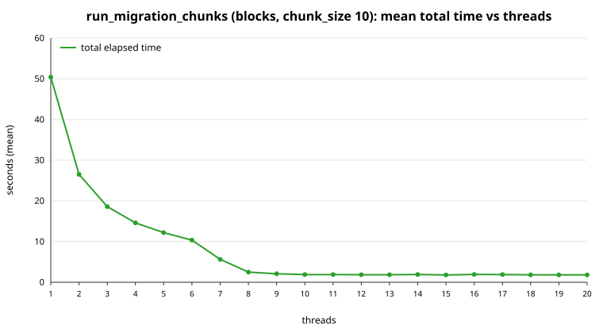
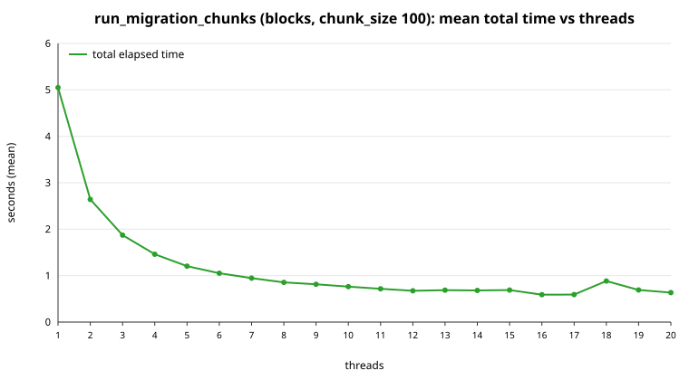
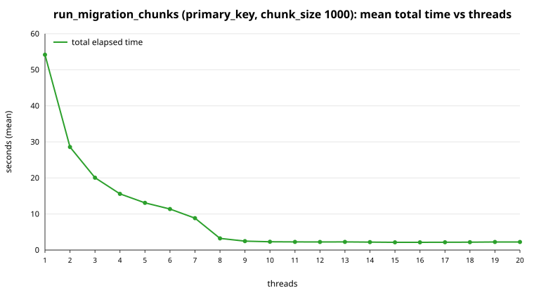
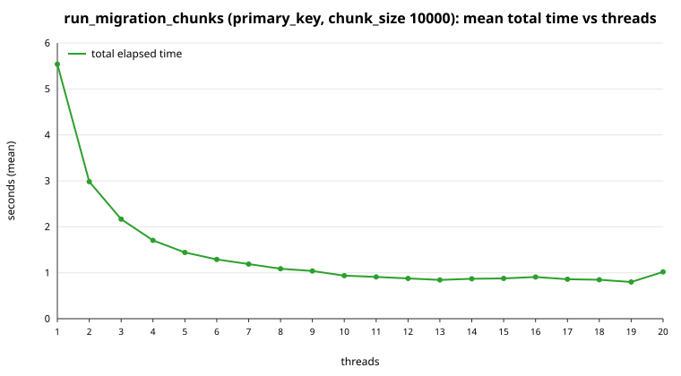

# Chunked migration thread-scaling benchmark

Generated: 2026-10-08T05:21:01Z

This page is generated by `benchmark/report.sh` from
`results/benchmark.csv`. Re-run it after more runs to refresh
the means; the CSV accumulates across invocations of `run.sh`. The
results are grouped by the chunking strategy recorded in each row.

## Configuration

| parameter                 | value                                           |
|---------------------------|-------------------------------------------------|
| image                     | `dml-utils-postgres:17-alpine`                  |
| source table              | `benchmark.bench_source`                        |
| target table              | `benchmark.bench_target`                        |
| rows                      | 1000000                                         |
| chunk_by (current config) | `primary_key`                                   |
| chunk size                | 10000 (rows for primary_key, blocks for blocks) |
| threads                   | 1 .. 20                                         |
| measured runs per thread  | 10                                              |
| warm-up runs per thread   | 1                                               |
| truncate target each run  | 1                                               |
| max_worker_processes      | 30                                              |
| shared_buffers            | 512MB                                           |

Dataset (live):

```
blocks | 9346
rows | 1000000
```

Workload SQL (run once per chunk, `<driving_table>` aliased `t`):

```sql
INSERT INTO benchmark.bench_target (id, payload)
SELECT t.id, t.payload
FROM <driving_table>
WHERE <chunking_clause>
```

## Hardware and software

```
captured: 2026-10-08T05:21:01Z
host: system76-pc

Linux system76-pc 7.1.5-76070105-generic #202607241434~1787955069~26.04~9520501~dev SMP PREEMPT_DYNAMIC F x86_64 GNU/Linux

Architecture:                            x86_64
CPU op-mode(s):                          32-bit, 64-bit
Address sizes:                           39 bits physical, 48 bits virtual
Byte Order:                              Little Endian
CPU(s):                                  20
On-line CPU(s) list:                     0-19
Vendor ID:                               GenuineIntel
Model name:                              12th Gen Intel(R) Core(TM) i7-12700H
CPU family:                              6
Model:                                   154
Thread(s) per core:                      2
Core(s) per socket:                      14
Socket(s):                               1
Stepping:                                3
CPU(s) scaling MHz:                      54%
CPU max MHz:                             4700.0000
CPU min MHz:                             400.0000
BogoMIPS:                                5376.00
Flags:                                   fpu vme de pse tsc msr pae mce cx8 apic sep mtrr pge mca cmov pat pse36 clflush dts acpi mmx fxsr sse sse2 ss ht tm pbe syscall nx pdpe1gb rdtscp lm constant_tsc art arch_perfmon pebs bts rep_good nopl xtopology nonstop_tsc cpuid aperfmperf tsc_known_freq pni pclmulqdq dtes64 monitor ds_cpl vmx smx est tm2 ssse3 sdbg fma cx16 xtpr pdcm pcid sse4_1 sse4_2 x2apic movbe popcnt tsc_deadline_timer aes xsave avx f16c rdrand lahf_lm abm 3dnowprefetch cpuid_fault epb ssbd ibrs ibpb stibp ibrs_enhanced tpr_shadow flexpriority ept vpid ept_ad fsgsbase tsc_adjust bmi1 avx2 smep bmi2 erms invpcid rdseed adx smap clflushopt clwb intel_pt sha_ni xsaveopt xsavec xgetbv1 xsaves split_lock_detect user_shstk avx_vnni dtherm ida arat pln pts hwp hwp_notify hwp_act_window hwp_epp hwp_pkg_req hfi vnmi umip pku ospke waitpkg gfni vaes vpclmulqdq rdpid movdiri movdir64b fsrm md_clear serialize arch_lbr ibt flush_l1d arch_capabilities
Virtualization:                          VT-x
L1d cache:                               544 KiB (14 instances)
L1i cache:                               704 KiB (14 instances)
L2 cache:                                11.5 MiB (8 instances)
L3 cache:                                24 MiB (1 instance)
NUMA node(s):                            1
NUMA node0 CPU(s):                       0-19
Vulnerability Gather data sampling:      Not affected
Vulnerability Ghostwrite:                Not affected
Vulnerability Indirect target selection: Not affected
Vulnerability Itlb multihit:             Not affected
Vulnerability L1tf:                      Not affected
Vulnerability Mds:                       Not affected
Vulnerability Meltdown:                  Not affected
Vulnerability Mmio stale data:           Not affected
Vulnerability Old microcode:             Not affected
Vulnerability Reg file data sampling:    Mitigation; Clear Register File
Vulnerability Retbleed:                  Not affected
Vulnerability Spec rstack overflow:      Not affected
Vulnerability Spec store bypass:         Mitigation; Speculative Store Bypass disabled via prctl
Vulnerability Spectre v1:                Mitigation; usercopy/swapgs barriers and __user pointer sanitization
Vulnerability Spectre v2:                Mitigation; Enhanced / Automatic IBRS; IBPB conditional; PBRSB-eIBRS SW sequence; BHI BHI_DIS_S
Vulnerability Srbds:                     Not affected
Vulnerability Tsa:                       Not affected
Vulnerability Tsx async abort:           Not affected
Vulnerability Vmscape:                   Mitigation; IBPB before exit to userspace

nproc: 20

               total        used        free      shared  buff/cache   available
Mem:            62Gi        15Gi        30Gi       1.4Gi        18Gi        46Gi
Swap:          4.0Gi          0B       4.0Gi

Filesystem      Size  Used Avail Use% Mounted on
/dev/nvme0n1p2  1.8T  268G  1.5T  16% /

docker client 29.8.1 / server 29.8.1
```

## PostgreSQL settings

```
         name         | setting | unit
----------------------+---------+------
 autovacuum           | on      |
 checkpoint_timeout   | 300     | s
 effective_cache_size | 524288  | 8kB
 fsync                | on      |
 full_page_writes     | on      |
 maintenance_work_mem | 65536   | kB
 max_connections      | 100     |
 max_worker_processes | 30      |
 random_page_cost     | 4       |
 seq_page_cost        | 1       |
 server_version       | 17.11   |
 shared_buffers       | 65536   | 8kB
 synchronous_commit   | on      |
 wal_level            | replica |
 work_mem             | 4096    | kB
(15 rows)

```

## Results (mean over the measured runs)

### strategy `blocks`, chunk_size 10 blocks

| threads | runs | chunks | rows/chunk | blocks/chunk | mean range calc (s) | mean chunk run (s) | mean total (s) | speedup vs first |
|--------:|-----:|-------:|-----------:|-------------:|--------------------:|-------------------:|---------------:|-----------------:|
|       1 |   10 |    935 |       1070 |           10 |               0.034 |             50.358 |         50.392 |            1.00x |
|       2 |   10 |    935 |       1070 |           10 |               0.030 |             26.484 |         26.514 |            1.90x |
|       3 |   10 |    935 |       1070 |           10 |               0.029 |             18.555 |         18.584 |            2.71x |
|       4 |   10 |    935 |       1070 |           10 |               0.029 |             14.557 |         14.586 |            3.45x |
|       5 |   10 |    935 |       1070 |           10 |               0.030 |             12.165 |         12.195 |            4.13x |
|       6 |   10 |    935 |       1070 |           10 |               0.030 |             10.312 |         10.341 |            4.87x |
|       7 |   10 |    935 |       1070 |           10 |               0.030 |              5.590 |          5.621 |            8.97x |
|       8 |   10 |    935 |       1070 |           10 |               0.032 |              2.463 |          2.495 |           20.20x |
|       9 |   10 |    935 |       1070 |           10 |               0.031 |              2.057 |          2.088 |           24.13x |
|      10 |   10 |    935 |       1070 |           10 |               0.032 |              1.859 |          1.891 |           26.64x |
|      11 |   10 |    935 |       1070 |           10 |               0.032 |              1.850 |          1.882 |           26.77x |
|      12 |   10 |    935 |       1070 |           10 |               0.033 |              1.822 |          1.855 |           27.17x |
|      13 |   10 |    935 |       1070 |           10 |               0.034 |              1.815 |          1.849 |           27.26x |
|      14 |   10 |    935 |       1070 |           10 |               0.034 |              1.878 |          1.912 |           26.35x |
|      15 |   10 |    935 |       1070 |           10 |               0.034 |              1.766 |          1.800 |           28.00x |
|      16 |   10 |    935 |       1070 |           10 |               0.035 |              1.889 |          1.924 |           26.20x |
|      17 |   10 |    935 |       1070 |           10 |               0.034 |              1.851 |          1.885 |           26.73x |
|      18 |   10 |    935 |       1070 |           10 |               0.034 |              1.789 |          1.823 |           27.65x |
|      19 |   10 |    935 |       1070 |           10 |               0.034 |              1.785 |          1.820 |           27.69x |
|      20 |   10 |    935 |       1070 |           10 |               0.034 |              1.786 |          1.820 |           27.69x |



### strategy `blocks`, chunk_size 100 blocks

| threads | runs | chunks | rows/chunk | blocks/chunk | mean range calc (s) | mean chunk run (s) | mean total (s) | speedup vs first |
|--------:|-----:|-------:|-----------:|-------------:|--------------------:|-------------------:|---------------:|-----------------:|
|       1 |   10 |     94 |      10638 |           99 |               0.006 |              5.043 |          5.049 |            1.00x |
|       2 |   10 |     94 |      10638 |           99 |               0.006 |              2.636 |          2.641 |            1.91x |
|       3 |   10 |     94 |      10638 |           99 |               0.006 |              1.867 |          1.873 |            2.70x |
|       4 |   10 |     94 |      10638 |           99 |               0.006 |              1.455 |          1.461 |            3.46x |
|       5 |   10 |     94 |      10638 |           99 |               0.006 |              1.198 |          1.204 |            4.19x |
|       6 |   10 |     94 |      10638 |           99 |               0.006 |              1.046 |          1.052 |            4.80x |
|       7 |   10 |     94 |      10638 |           99 |               0.006 |              0.940 |          0.946 |            5.34x |
|       8 |   10 |     94 |      10638 |           99 |               0.006 |              0.850 |          0.855 |            5.90x |
|       9 |   10 |     94 |      10638 |           99 |               0.005 |              0.809 |          0.814 |            6.20x |
|      10 |   10 |     94 |      10638 |           99 |               0.006 |              0.757 |          0.763 |            6.62x |
|      11 |   10 |     94 |      10638 |           99 |               0.006 |              0.710 |          0.716 |            7.05x |
|      12 |   10 |     94 |      10638 |           99 |               0.006 |              0.669 |          0.675 |            7.48x |
|      13 |   10 |     94 |      10638 |           99 |               0.006 |              0.682 |          0.688 |            7.34x |
|      14 |   10 |     94 |      10638 |           99 |               0.006 |              0.676 |          0.682 |            7.40x |
|      15 |   10 |     94 |      10638 |           99 |               0.006 |              0.683 |          0.689 |            7.33x |
|      16 |   10 |     94 |      10638 |           99 |               0.006 |              0.585 |          0.590 |            8.55x |
|      17 |   10 |     94 |      10638 |           99 |               0.006 |              0.587 |          0.592 |            8.52x |
|      18 |   10 |     94 |      10638 |           99 |               0.006 |              0.879 |          0.884 |            5.71x |
|      19 |   10 |     94 |      10638 |           99 |               0.006 |              0.686 |          0.692 |            7.30x |
|      20 |   10 |     94 |      10638 |           99 |               0.006 |              0.630 |          0.635 |            7.94x |



### strategy `primary_key`, chunk_size 1000 rows

| threads | runs | chunks | rows/chunk | blocks/chunk | mean range calc (s) | mean chunk run (s) | mean total (s) | speedup vs first |
|--------:|-----:|-------:|-----------:|-------------:|--------------------:|-------------------:|---------------:|-----------------:|
|       1 |   10 |   1000 |       1000 |            9 |               0.184 |             53.992 |         54.176 |            1.00x |
|       2 |   10 |   1000 |       1000 |            9 |               0.184 |             28.390 |         28.574 |            1.90x |
|       3 |   10 |   1000 |       1000 |            9 |               0.184 |             19.874 |         20.058 |            2.70x |
|       4 |   10 |   1000 |       1000 |            9 |               0.185 |             15.408 |         15.592 |            3.47x |
|       5 |   10 |   1000 |       1000 |            9 |               0.185 |             12.901 |         13.086 |            4.14x |
|       6 |   10 |   1000 |       1000 |            9 |               0.186 |             11.190 |         11.376 |            4.76x |
|       7 |   10 |   1000 |       1000 |            9 |               0.185 |              8.651 |          8.836 |            6.13x |
|       8 |   10 |   1000 |       1000 |            9 |               0.188 |              3.043 |          3.232 |           16.76x |
|       9 |   10 |   1000 |       1000 |            9 |               0.194 |              2.284 |          2.478 |           21.86x |
|      10 |   10 |   1000 |       1000 |            9 |               0.195 |              2.094 |          2.289 |           23.67x |
|      11 |   10 |   1000 |       1000 |            9 |               0.198 |              2.060 |          2.258 |           23.99x |
|      12 |   10 |   1000 |       1000 |            9 |               0.196 |              2.048 |          2.244 |           24.14x |
|      13 |   10 |   1000 |       1000 |            9 |               0.195 |              2.061 |          2.256 |           24.01x |
|      14 |   10 |   1000 |       1000 |            9 |               0.196 |              1.996 |          2.192 |           24.71x |
|      15 |   10 |   1000 |       1000 |            9 |               0.196 |              1.953 |          2.150 |           25.20x |
|      16 |   10 |   1000 |       1000 |            9 |               0.197 |              1.943 |          2.140 |           25.31x |
|      17 |   10 |   1000 |       1000 |            9 |               0.198 |              1.956 |          2.155 |           25.14x |
|      18 |   10 |   1000 |       1000 |            9 |               0.199 |              1.989 |          2.188 |           24.76x |
|      19 |   10 |   1000 |       1000 |            9 |               0.198 |              2.038 |          2.236 |           24.23x |
|      20 |   10 |   1000 |       1000 |            9 |               0.197 |              2.036 |          2.233 |           24.26x |



### strategy `primary_key`, chunk_size 10000 rows

| threads | runs | chunks | rows/chunk | blocks/chunk | mean range calc (s) | mean chunk run (s) | mean total (s) | speedup vs first |
|--------:|-----:|-------:|-----------:|-------------:|--------------------:|-------------------:|---------------:|-----------------:|
|       1 |   10 |    100 |      10000 |           93 |               0.151 |              5.388 |          5.539 |            1.00x |
|       2 |   10 |    100 |      10000 |           93 |               0.152 |              2.829 |          2.982 |            1.86x |
|       3 |   10 |    100 |      10000 |           93 |               0.152 |              2.014 |          2.166 |            2.56x |
|       4 |   10 |    100 |      10000 |           93 |               0.152 |              1.552 |          1.704 |            3.25x |
|       5 |   10 |    100 |      10000 |           93 |               0.153 |              1.289 |          1.442 |            3.84x |
|       6 |   10 |    100 |      10000 |           93 |               0.153 |              1.136 |          1.289 |            4.30x |
|       7 |   10 |    100 |      10000 |           93 |               0.154 |              1.035 |          1.188 |            4.66x |
|       8 |   10 |    100 |      10000 |           93 |               0.153 |              0.934 |          1.087 |            5.10x |
|       9 |   10 |    100 |      10000 |           93 |               0.154 |              0.885 |          1.039 |            5.33x |
|      10 |   10 |    100 |      10000 |           93 |               0.155 |              0.783 |          0.938 |            5.91x |
|      11 |   10 |    100 |      10000 |           93 |               0.155 |              0.755 |          0.910 |            6.09x |
|      12 |   10 |    100 |      10000 |           93 |               0.156 |              0.721 |          0.876 |            6.32x |
|      13 |   10 |    100 |      10000 |           93 |               0.154 |              0.688 |          0.843 |            6.57x |
|      14 |   10 |    100 |      10000 |           93 |               0.155 |              0.714 |          0.869 |            6.38x |
|      15 |   10 |    100 |      10000 |           93 |               0.157 |              0.721 |          0.877 |            6.31x |
|      16 |   10 |    100 |      10000 |           93 |               0.158 |              0.749 |          0.907 |            6.11x |
|      17 |   10 |    100 |      10000 |           93 |               0.158 |              0.702 |          0.859 |            6.45x |
|      18 |   10 |    100 |      10000 |           93 |               0.156 |              0.691 |          0.847 |            6.54x |
|      19 |   10 |    100 |      10000 |           93 |               0.157 |              0.642 |          0.798 |            6.94x |
|      20 |   10 |    100 |      10000 |           93 |               0.156 |              0.862 |          1.019 |            5.44x |



## How the times are measured

- **range calc** = `boundaries_calculated_at - started_at`: the
  chunk-boundary calculation (a primary-key index scan for `primary_key`,
  an O (1) block count for `blocks`).
- **chunk run** = `completed_at - boundaries_calculated_at`: the workload SQL
  run over every chunk, up to the thread count at a time.
- **total** = `completed_at - started_at`.
- **rows/chunk** and **blocks/chunk** are the live source counts (see the
  Dataset section) divided by the mean chunk count. A block holds a variable
  number of rows, so for `blocks` these are averages and the final chunk is
  usually smaller than the rest.
- Warm-up runs are not recorded. The mean is over the measured runs only, and
  the CSV accumulates across invocations, so the mean covers every run recorded
  for that strategy and thread value.
- Speedup is relative to the lowest thread value for that strategy.

## Caveats

- The source data is synthetic and deterministic; a refresh reproduces it
  exactly. Only the columns the workload reads are present.
- The default workload INSERTs into a throwaway target, so the source is never
  modified and each run starts from the same state. This makes the source
  quiescent, which is required for the `blocks` strategy.
- `primary_key` and `blocks` are not directly comparable at the same numeric
  chunk size: `primary_key` chunks a fixed number of rows, `blocks` a fixed
  number of heap blocks, and a block holds a variable number of rows.
- Autovacuum, checkpoints and other background activity can add noise; run more
  measured runs (increase `BENCH_RUNS`) to tighten the mean.
- Each thread is one `pg_background` worker; the count is capped by
  `max_worker_processes`, which is why the benchmark uses its own container.
